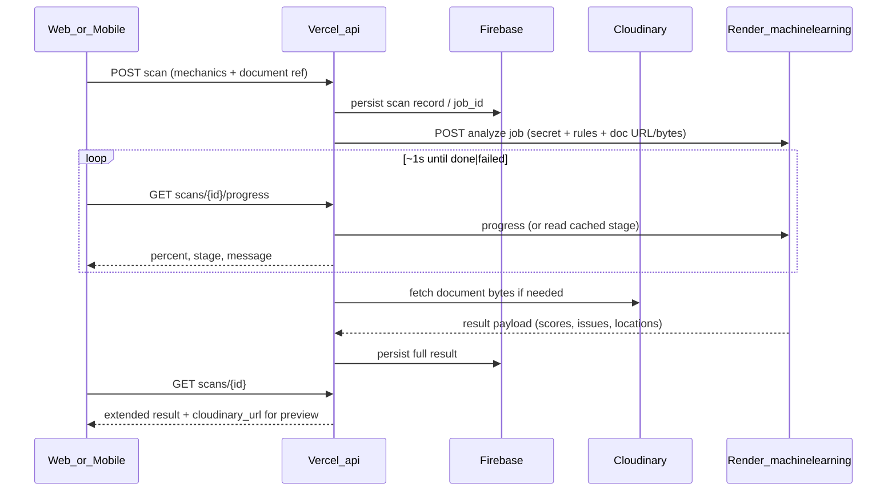

# ML Document Checking — Developer Guide

This document describes the **Render-hosted** `machinelearning/` FastAPI service and how it fits with the existing Vercel **`api/`** gateway, clients, and legacy **`paperpilot-ml/`** tree. For the agreed product plan, see [`PLAN.md`](./PLAN.md).

## Locked architecture decisions

| ID | Decision |
|----|----------|
| **1A** | **Hybrid pipeline:** deterministic layout/format compliance is the source of truth; ML assists guide→rules extraction, issue typing, severity in edge cases |
| **2C** | **Rule-bases:** structured mechanics CRUD + optional style-guide upload to auto-fill/refine (`POST /mechanics/extract` stays on gateway; heavy steps may delegate to Render) |
| **3A** | **Gateway:** Vercel `api/` owns Firebase, Cloudinary fetch, auth boundaries; **only** `api/` calls Render; clients never hold `ML_SERVICE_KEY` |
| **4A** | Many saved mechanics; **one** `mechanics_id` (or equivalent) per scan |
| **5B** | Web + mobile: progress polling, summary modal, reference tracing |

## End-to-end flow



## Hybrid pipeline (Render service)

1. **Job intake** — Document as HTTPS URL (typically Cloudinary delivery URL resolved server-side) or raw bytes; normalized `mechanics.rules` JSON; optional client-supplied `job_id` for idempotency.
2. **Parse** — Port/reuse [`api/app/documents.py`](../../api/app/documents.py): build pages, lines/units, metadata (`pdf` vs `docx`).
3. **Deterministic compliance** — Port/adapt [`api/app/compliance.py`](../../api/app/compliance.py): `_document_units`, category checks (`Fonts`, `Margins`, `Indentation`, `Spacing`, `Alignment`, …), `IssueCollector`, locations via `_location(page, line, category)`.
4. **ML-assisted layers** (non-blocking for core pass/fail where possible):
   - Guide/mechanics extract enrichment (patterns from [`paperpilot-ml/`](../../paperpilot-ml), [`mechanics_ml.py`](../../api/app/mechanics_ml.py))
   - Optional citation-style predictors ([`citation_ml.py`](../../api/app/citation_ml.py)) — **legacy/auxiliary**, not the sole scan path
   - Optional LLM refinement of severity/XAI copy ([`gemini_client.py`](../../api/app/gemini_client.py)) — bounded one-step severity changes; scan must not *depend* on Gemini for base measurements
5. **Progress** — Stages: `queued` → `parsing` → `checking` → `scoring` → `done` | `failed`
6. **Response** — Aggregated scoring (below), `issues[]`, `sections`/breakdown, pagination meta, per-issue `locations` and optional bbox/highlight hints for UI mappers.

### Deterministic vs ML-assisted

| Concern | Primary mechanism |
|---------|-------------------|
| Font name/size, margins, indent, spacing, alignment, page size | **Deterministic** measurement vs `mechanics.rules` |
| Right/wrong %, category wrong %, severity % | **Deterministic** arithmetic over units/issues |
| Mechanics form pre-fill from uploaded guide PDF/DOCX | **Heuristics + optional ML** extract |
| Citation “predicted style” mismatch | **Optional** small classifier from `paperpilot-ml` |
| Wording / severity tweak on already-detected issues | **Optional** Gemini enrichment |

## Unit scoring formulas

The product-facing **right/wrong** model (see plan) is defined over **check units** (lines/regions evaluated), not over the legacy `overall_score` alone. The gateway/ML service should expose both during migration if needed.

**Planned v1 metrics (Render result + gateway extension):**

- `total_units` — count of evaluated units  
- `passed_units` — units with no failing check in scope  
- `right_pct = passed_units / total_units * 100`  
- `wrong_pct = 100 - right_pct`  

**Category wrong %** (slices sum to 100% of *wrong*, not of whole document):

- For each category `c` in `{Fonts, Margins, Indentation, Spacing, Alignment, Paper size, …}`:  
  `category_wrong_pct[c] = failing_units_in_c / sum(failing_units_all_categories) * 100`  

**Severity %** (over failing units or weighted issue counts):

- `severity_pct[critical|moderate|minor] = failing_weight_in_bucket / total_failing_weight * 100`  

**Legacy reference (`run_compliance_scan` today):** per-section `CategoryStats.score()`, `overall_score` as mean of measured section scores, breakdown via `_build_breakdown`. New UI fields map through [`scanMapper.js`](../../web/src/lib/scanMapper.js) (and mobile mirror) to add `right_pct`, `wrong_pct`, category wrong slices, severity chips.

## Job and progress API shapes (illustrative)

Names are **illustrative**; gateway owns canonical routes. Render exposes a parallel internal contract invoked only from `api/`.

### Gateway (client-facing)

**Start scan**

```http
POST /.../scan
```

Request (conceptual): `{ mechanics_id, document_id | cloudinary_url, tier? }`  
Response: `{ scan_id, job_id? }`

**Progress**

```http
GET /.../scans/{scan_id}/progress
```

Response:

```json
{
  "percent": 72,
  "stage": "checking",
  "message": "Checking margins and fonts"
}
```

`stage` ∈ `queued | parsing | checking | scoring | done | failed`

**Full result**

```http
GET /.../scans/{scan_id}
```

Response extends existing scan payload with:

```json
{
  "right_pct": 84.2,
  "wrong_pct": 15.8,
  "category_wrong_pct": [
    { "section": "Fonts", "pct_of_wrong": 40.0 },
    { "section": "Margins", "pct_of_wrong": 35.0 }
  ],
  "severity_pct": {
    "critical": 10.0,
    "moderate": 55.0,
    "minor": 35.0
  },
  "issues": [
    {
      "issue_type": "font_size_mismatch",
      "severity": "moderate",
      "message": "...",
      "recommendation": "...",
      "locations": [
        {
          "page_index": 3,
          "line_index": 12,
          "section": "Fonts",
          "bbox": { "x": 0.1, "y": 0.2, "w": 0.5, "h": 0.02 }
        }
      ]
    }
  ],
  "cloudinary_url": "https://res.cloudinary.com/...",
  "page_count": 42
}
```

### Render (internal)

- `GET /health` — load balancer / Render health check  
- `POST /jobs/analyze` — body: rules + document reference + optional `job_id`; returns `{ job_id }`  
- `GET /jobs/{job_id}/progress` — same shape as gateway progress  
- `GET /jobs/{job_id}/result` — full ML payload when `stage === done`  

Auth: header e.g. `Authorization: Bearer <ML_SERVICE_KEY>` or shared secret agreed in SETUP; **reject** unauthenticated callers.

## Gateway vs Render responsibilities

| Responsibility | Vercel `api/` | Render `machinelearning/` |
|----------------|---------------|---------------------------|
| User/session auth, Firebase RTDB | Yes | No |
| Cloudinary upload URLs (client) / signed fetch (server) | Yes | Receives URL or bytes from gateway |
| Mechanics CRUD, extract endpoint orchestration | Yes | May run heavy parse/extract |
| Long-running PDF/DOCX compliance | Delegates | Yes |
| Progress polling surface for clients | Yes | Source of truth for job stage |
| Persisted scan history | Yes | Stateless job processor (optional short-lived cache) |

Env on **Vercel** (gateway): `ML_SERVICE_URL`, `ML_SERVICE_KEY`, existing Firebase/Cloudinary vars ([`.env.example`](../../api/.env.example)).

Env on **Render**: app port, `ML_SERVICE_KEY` (match gateway), any optional keys for extract/Gemini; no Firebase requirement on ML container if gateway passes rules + doc.

## Locations and highlights (reference tracing)

**Issue location model** (aligned with [`compliance.py`](../../api/app/compliance.py) `_location`):

- `page_index` (0-based or 1-based — **standardize in mapper**; web preview should match `DocumentPagePreview`)
- `line_index` when available from parse units
- `section` — category string (`Fonts`, `Margins`, …)
- Optional `bbox` — normalized page coordinates for PDF overlay

**UI behavior (5B):**

- Click issue → scroll preview to page/line  
- Visual: soft red background + underline (default)  
- PDF: `cloudinary_url` + bbox/page from result  
- DOCX: same indices; highlight best-effort at line/paragraph granularity  

Extend [`scanMapper.js`](../../web/src/lib/scanMapper.js) and mobile equivalent so summary modal and `ScanResultsScreen` share one normalized issue list.

## Role of existing `paperpilot-ml/`

- **Today:** training scripts and small citation (and related) models referenced from [`api/app/citation_ml.py`](../../api/app/citation_ml.py) and [`mechanics_ml.py`](../../api/app/mechanics_ml.py).
- **Target:** **`machinelearning/`** is the **production analyze** service on Render. **`paperpilot-ml/`** remains the lab for train/eval artifacts; migrate reusable inference code into `machinelearning/` over time.
- **Avoid:** two separate Render apps both claiming to be “the ML API.”

## Deploy (Render)

- Root: `PaperPilot-main/machinelearning/`  
- Process: `uvicorn app.main:app --host 0.0.0.0 --port $PORT`  
- Artifacts: `requirements.txt`, optional `Dockerfile`  
- Health: `GET /health`  

Detailed env checklist lives in future `SETUP` under this folder (separate todo: `render-deploy-docs`).

## Out of scope (implementation)

- Multi mechanics compare in one job  
- CORS/public Render URL for browsers  
- Character-perfect DOCX highlights  
- v1 dependency on large labeled paper corpora  

## Related client docs

Non-technical overview and FAQ: [`HOW_IT_WORKS_CLIENT.md`](./HOW_IT_WORKS_CLIENT.md).
