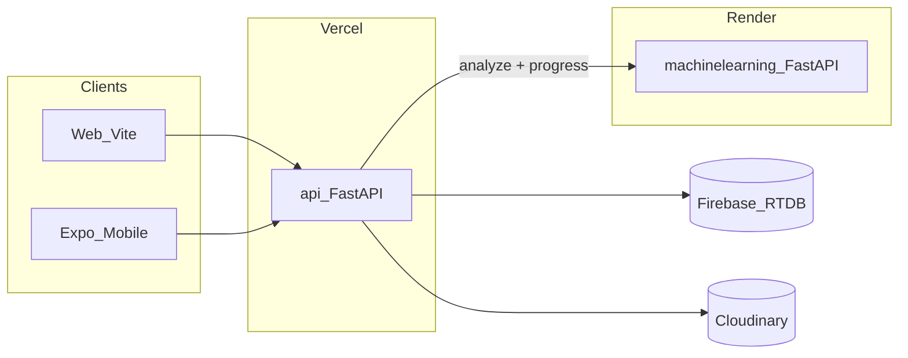

# ML Document Checking on Render

## Decisions locked

- **1A Hybrid:** exact format checks stay deterministic; ML assists guide→rules extraction, severity/issue typing, messy cases
- **2C Rule-bases:** structured mechanics form + optional style-guide PDF/DOCX upload to auto-fill/refine
- **3A Gateway:** Vercel [`api/`](../api) owns auth/Firebase/Cloudinary/mechanics; calls Render ML; browser never hits Render
- **4A:** many saved mechanics; **one** selected per scan
- **5B:** ship progress + results modal + reference tracing on **web and mobile**
- **Scoring:** right% + wrong% = 100%; wrong broken down by category %; severity % with colors (critical / moderate / minor)

## Documentation deliverables (before feature code)

Create under [`PaperPilot-main/machinelearning/docs/`](./):

1. **`PLAN.md`** — copy of this agreed plan (architecture, decisions, scope, deploy) for the repo
2. **`HOW_IT_WORKS_CLIENT.md`** — simple language for client presentations: what gets checked, right/wrong %, category breakdown, severity colors, progress modal, click-to-fix errors; no jargon
3. **`HOW_IT_WORKS_DEV.md`** — developer terms: hybrid pipeline, unit scoring formulas, job/progress API, gateway vs Render, location/highlight model, env vars, what is deterministic vs ML-assisted

Order of work: write these three first, then scaffold the service.

## Do we need a dataset?

**Mostly no** for the core product (format / font / size / indentation / margins / paper size).

| Piece | Dataset needed? | Why |
|-------|-----------------|-----|
| Layout & format checks | **No** | Measure the PDF/DOCX (font name, pt size, margins, page size) and compare to the selected mechanics rules |
| Right / wrong / category / severity % | **No** | Arithmetic over pass/fail units and severity labels from rules |
| Rule-base form + guide → template fill | **Mostly no** | Extraction/heuristics (+ optional light ML); each university guide is **config**, not training data |
| Citation style classifiers (existing `paperpilot-ml`) | **Only if we keep training those** | Small labeled citation set; optional, not required for format compliance |
| Future: better OCR / fuzzy severity from many labeled papers | **Optional later** | Nice-to-have; not required for v1 hybrid on Render |

**Client-safe line:** “We do not need you to collect hundreds of graded papers. Users bring their rule guide + research paper; the system measures the paper against those rules.”

**What users upload is not an ML training dataset** — it is the rule profile and the document under test for that scan.

## Architecture

### New service: [`PaperPilot-main/machinelearning/`](../)

Standalone FastAPI app (Render-only deployment). Not Vercel serverless.

**Core pipeline**

1. Accept job: document URL or bytes + normalized `mechanics.rules` (+ optional job id)
2. Parse PDF/DOCX (reuse/port logic from [`api/app/documents.py`](../../api/app/documents.py) + compliance units)
3. Run hybrid checks (port/adapt [`api/app/compliance.py`](../../api/app/compliance.py) as the deterministic core)
4. ML helpers: guide enrichment / severity classification (extend patterns from existing [`paperpilot-ml/`](../../paperpilot-ml); do not leave citation-only ML as the scan path)
5. Emit progress stages: `queued → parsing → checking → scoring → done|failed`
6. Return: overall right/wrong %, category wrong breakdown, severity %, issues with locations (`page`, `line`, bbox when available), highlight hints

**Scoring model (concrete)**

- Count check **units** (e.g. per prose line / region evaluated against rules)
- `right_pct = passed / total * 100`
- `wrong_pct = 100 - right_pct`
- Category wrong % = share of failing units in that category (Fonts, Margins, Indentation, Spacing, Alignment, Paper size, …) — slices sum to 100% of wrong
- Severity % = share of failing units (or weighted issues) in critical / moderate / minor — colored in UI

**Auth to Render:** shared service secret (`ML_SERVICE_KEY`); only `api/` may call it.

### Gateway changes: [`PaperPilot-main/api/`](../../api)

- Keep mechanics CRUD + Cloudinary + manuscript versions in Firebase
- Change scan path: instead of (or after thin prep) only local `run_compliance_scan`, create ML job via Render client, persist `scan_id` / `job_id`, expose progress
- New/adjusted endpoints (names illustrative):
  - `POST .../scan` → starts job, returns `scan_id`
  - `GET .../scans/{id}/progress` → `{ percent, stage, message }`
  - `GET .../scans/{id}` → full result payload (existing shape extended)
- Env: `ML_SERVICE_URL`, `ML_SERVICE_KEY` (owner of Vercel account sets these; you can build/deploy Render independently)
- **2C:** keep `POST /mechanics/extract` + form save; route heavy extract/enrich through Render when useful; users still edit structured fields before save

### Existing `paperpilot-ml/`

Treat as training/legacy citation helpers. New production analyze service lives in **`machinelearning/`**. Migrate reusable train/predict pieces in; avoid two competing Render apps.

## Client UX (web + mobile)

### During analyze

- Replace spinner-only analyzing state in [`useScanFlow`](../../web/src/hooks/useScanFlow.js) / mobile equivalent with a **progress bar** driven by polling `.../progress` (interval ~1s until `done|failed`)

### After analyze — summary modal (not full screen)

- Compact score: right %, wrong %, top category wrong slices, severity chips with colors
- **Left:** View Document → document + issues side panel (reference tracing)
- **Right:** View Full Result (green) → existing full [`ScanResultsScreen`](../../web/src/components/cockpit/ScanResultsScreen.jsx) / mobile scan result

### Reference tracing

- Click issue/location → scroll manuscript to page/line
- Soft red background highlight on the span; **underline** as default error treatment
- PDF: use stored `cloudinary_url` + location/bbox from ML result (extend beyond upload-only [`DocumentPagePreview`](../../web/src/components/cockpit/DocumentPagePreview.jsx))
- DOCX: same location model; highlight fidelity may be approximate (line/paragraph), PDF is primary precision target

Shared mapping: extend [`scanMapper.js`](../../web/src/lib/scanMapper.js) (+ mobile mirror) for right/wrong, category wrong %, severity %, highlight coords.

## Deploy

- Render Web Service: `machinelearning/` → `uvicorn app.main:app`
- `requirements.txt`, `Dockerfile` or native Python build, health `GET /health`
- Document env vars in SETUP (Render + what Vercel `api/` needs); no requirement that you own the Vercel account

## Out of scope (explicit)

- Multi rule-base compare in one scan
- Browser → Render direct calls
- Replacing Firebase auth/storage
- Perfect DOCX character-level highlight (best-effort)
- Collecting a large labeled research-paper dataset for v1 (not required for hybrid approach)
